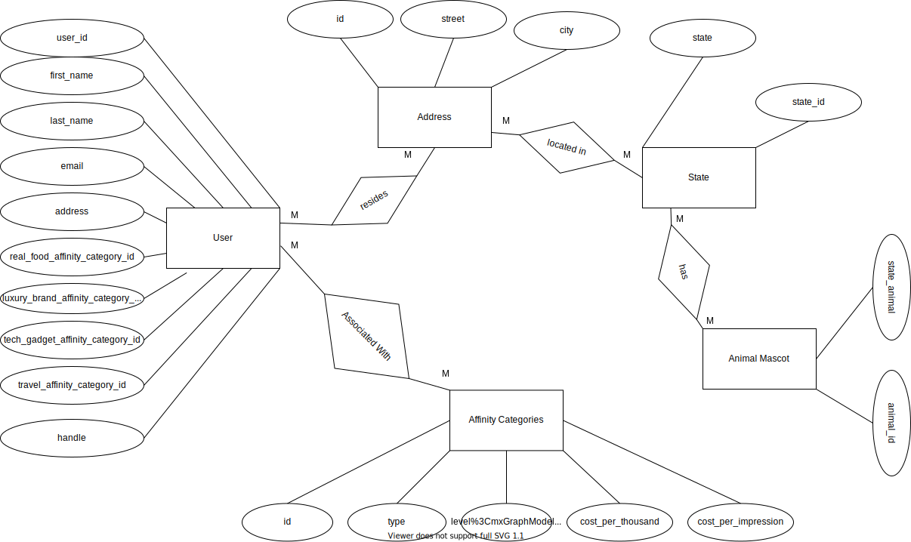

# Exam #1

The solutions content of this file below will be updated according to [the instructions](instructions/instructions.md).

## Solutions

The following sections contain a report on the solutions to each of the required components of this exam.

### Data munging

The code in the Python program, [solution.py](solution.py), contains the solutions to the **data munging** part of this exam.

### Spreadsheet analysis

The spreadsheet file, [users.xlsx](./data/users.xlsx), contains the solutions to the **spreadsheet analysis** part of this exam. In addition, the formulas used in that spreadsheet are indicated below:

**Make sure that all spreadsheet formulae you enter into this document work exactly as written.**

1. Total number of users of the social network

```
=COUNT(A2:A1001)
```

2. Number of users in each of the states in the New England region.

```
=COUNTIF(H2:H1001,N5)
=COUNTIF(H2:H1001,N6)
=COUNTIF(H2:H1001,N7)
=COUNTIF(H2:H1001,N8)
=COUNTIF(H2:H1001,N9)
=COUNTIF(H2:H1001,N10)
```

3. Number of users in each of the 5 most populous cities of the USA.

```
=COUNTIFS(G2:G1001,N13,H2:H1001,O13)
=COUNTIFS(G2:G1001,N14,H2:H1001,O14)
=COUNTIFS(G2:G1001,N15,H2:H1001,O15)
=COUNTIFS(G2:G1001,N16,H2:H1001,O16)
=COUNTIFS(G2:G1001,N17,H2:H1001,O17)
```

4. The average affinity category IDs of all users in New York for each of the content types.

```
=AVERAGEIF(H2:H1001,O20,I2:I1001)
=AVERAGEIF(H2:H1001,O21,J2:J58:J1001)
=AVERAGEIF(H2:H1001,O22,K2:K1001)
=AVERAGEIF(H2:H1001,O23,L2:L1001)
```

### SQL queries

This section shows the SQL queries that you determined solved each of the given problems.

**Make sure that all SQL commands you enter into this document work exactly as written, including semi-colons, where necessary.**

1. Write two SQL commands to create two tables named `users` and `affinity_categories` within the given database file.

```sql
CREATE TABLE users (
id INTEGER NOT NULL,
handle TEXT NOT NULL,
first_name TEXT NOT NULL,
last_name TEXT NOT NULL,
email TEXT NOT NULL,
street TEXT NOT NULL,
city TEXT NOT NULL,
state TEXT NOT NULL,
state_animal TEXT NOT NULL,
real_food_affinity_category_id NUMERIC NOT NULL,
luxury_brand_affinity_category_id NUMERIC NOT NULL,
tech_gadget_affinity_category_id NUMERIC NOT NULL,
travel_affinity_category_id NUMERIC NOT NULL
);
```

```sql
CREATE TABLE affinity_categories (
id INTEGER NOT NULL,
type TEXT NOT NULL,
level REAL NOT NULL,
cost_per_impression REAL NOT NULL,
cost_per_thousand REAL NOT NULL
);
```

2. Import the data in the `users.csv` and `affinity_categories.csv` CSV files into these two tables.

```sql
.mode csv
.headers on
.import ./users.csv users

```

```sql
.import ./affinity_categories.csv affinity_categories
```

3. Display the state name and the number of users in that state for each of the states for which we have users.

```sql
SELECT state,COUNT(handle) FROM users WHERE state <> '' GROUP BY state;
```

4. Display the state name, the number of users in that state, and the average `real_food_affinity_category_id` for each of the states for which we have users.

```sql
SELECT state,COUNT(handle),AVG(real_food_affinity_category_id) FROM users WHERE real_food_affinity_category_id <> '' GROUP BY state;
```

5. Display the email addresses only of all users residing in Oklahoma City, Oklahoma.

```sql
SELECT email FROM users WHERE city="Oklahoma City" and state="Oklahoma"; 
```

6. Display the email addresses of all users residing in Oklahoma City, Oklahoma, along with the price the social network would charge an advertiser to show one advertisement to each of them.

```sql
SELECT users.email,affinity_categories.cost_per_impression FROM users INNER JOIN
affinity_categories ON users.real_food_affinity_category_id = affinity_categories.id WHERE city="Oklahoma City" and state="Oklahoma";
```

7. Display the amount the social network would charge an advertiser to show one advertisement to two thousand users with a `real_food_affinity` level of `0.5`.

```sql
SELECT affinity_categories.cost_per_thousand*2 FROM affinity_categories WHERE type="real_food_affinity" AND level=0.5;
```

8. Show all the users for whom the `luxury_brand_affinity_category_id` field contains an invalid foreign key.

```sql
SELECT handle FROM users LEFT JOIN affinity_categories ON users.luxury_brand_affinity_category_id = affinity_categories.id WHERE affinity_categories.id IS NULL;
```

9. Write an additional SQL query of your choice using SQL with this table; then describe the results

Write a description of the query here.

This query finds the user with an affinity for travel who is the most expensive for the advertiser (per a thousand impressions) and displays both his/her handle as well as the cost.

```sql
SELECT users.handle,MAX(cost_per_thousand) FROM users INNER JOIN affinity_categories ON users.travel_affinity_category_id = affinity_categories.id;
```

### Normalization and Entity-relationship diagramming

This section contains responses to the questions on normalization and entity-relationship diagramming.

1. Is the data in `users.csv` in fourth normal form?

```
The data in users.csv is not in 4NF.
```

2. Explain why or why not the `users.csv` data meets 4NF.

```
In order to meet 4NF, a record must satisfy 1NF, 2NF, and 3NF. However we can see that the record does not satisfy 3NF since there are non-keys present that are facts about another non-key field(s) rather than only the primary key. For instance, the state animal tells a fact about the state because logically a state has a unique state animal associated with it. Furthermore, other non-keys can potentially be associated with one another such as city which is only associated with one state. Since, this violates the 3NF, it also violates 4NF.
```

3. Is the data in `affinity_categories.csv` in fourth normal form?

```
The data in affinity_categories.csv meets 4NF.
```

4. Explain why or why not the `affinity_categories.csv` data meets 4NF.

```
Under 4NF, a record may not have more than one independent multilevel fact about an entity. In the table, we see that non keys are related to the primary keys itself and are dependent of one another. For instance, the type, level, cost per impression, and cost per a thousand impressions are directly related to one another (greater affinity = greater cost per impression = greater cost per 1000 impressions).

Under 4NF, the 3 normal forms prior must be satisfied as well, and they are.

1NF - Fixed schema; same number of fields. Thus, this normal form is satisfied.
2NF - There are no composite keys, therefore this normal form is satisfied by default.
3NF - No non key fields are a fact about another non-key field. Therefore this normal form is satisfied as well.
```

5. Use [draw.io](https://draw.io) to draw an Entity-Relationship Diagram showing a 4NF-compliant form of this data, including primary key field(s), relationship(s), and cardinality.

The underlined attributes are the primary key for each entity. There are many users who lives in many addresses. The many addresses are located in many states. There are also many affinity categories.


